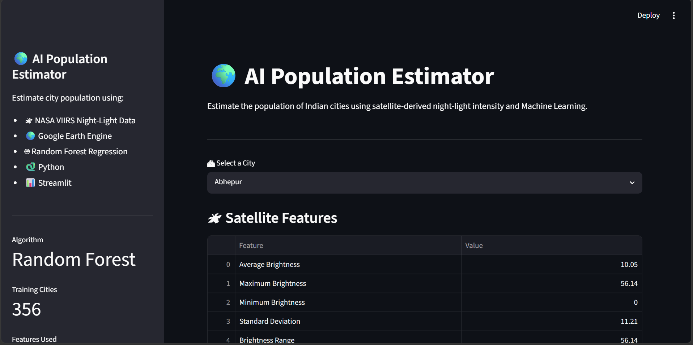
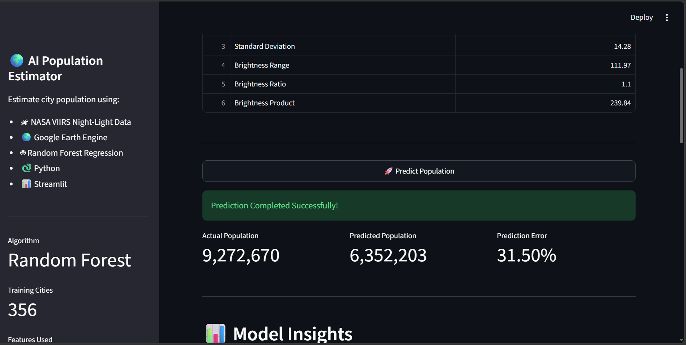
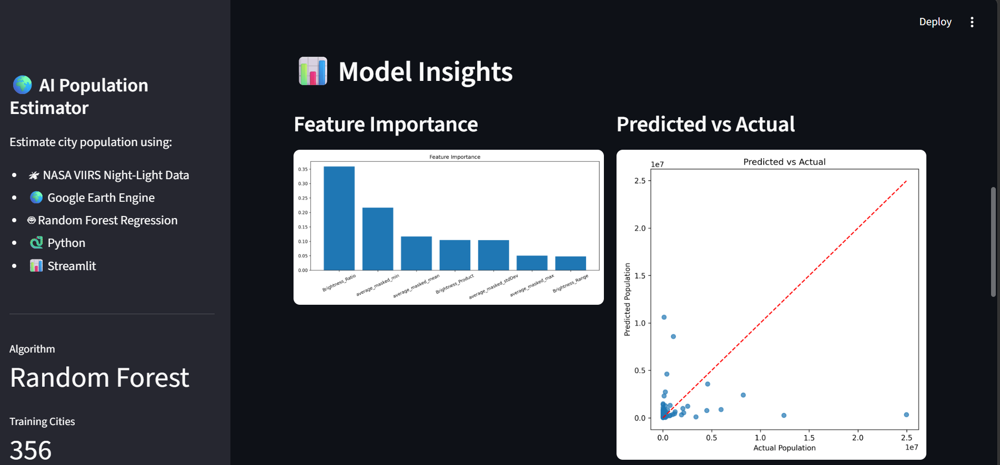
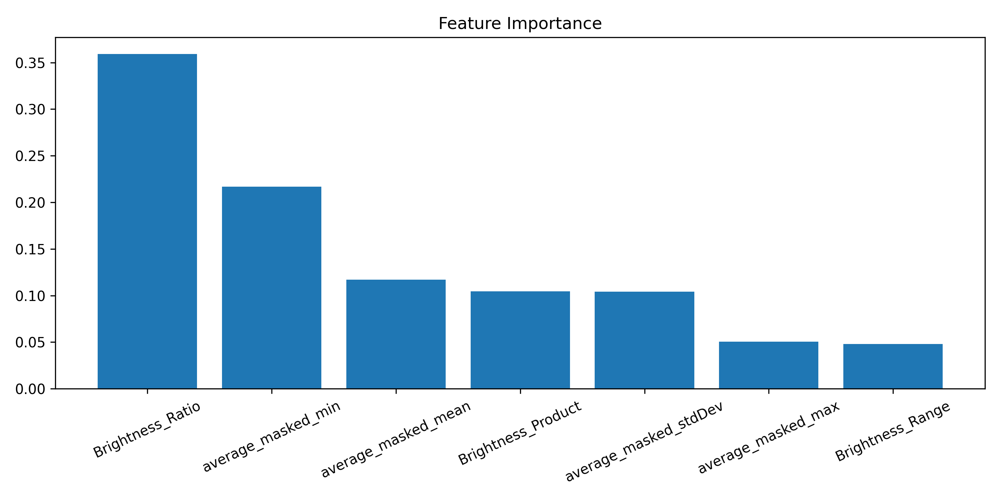
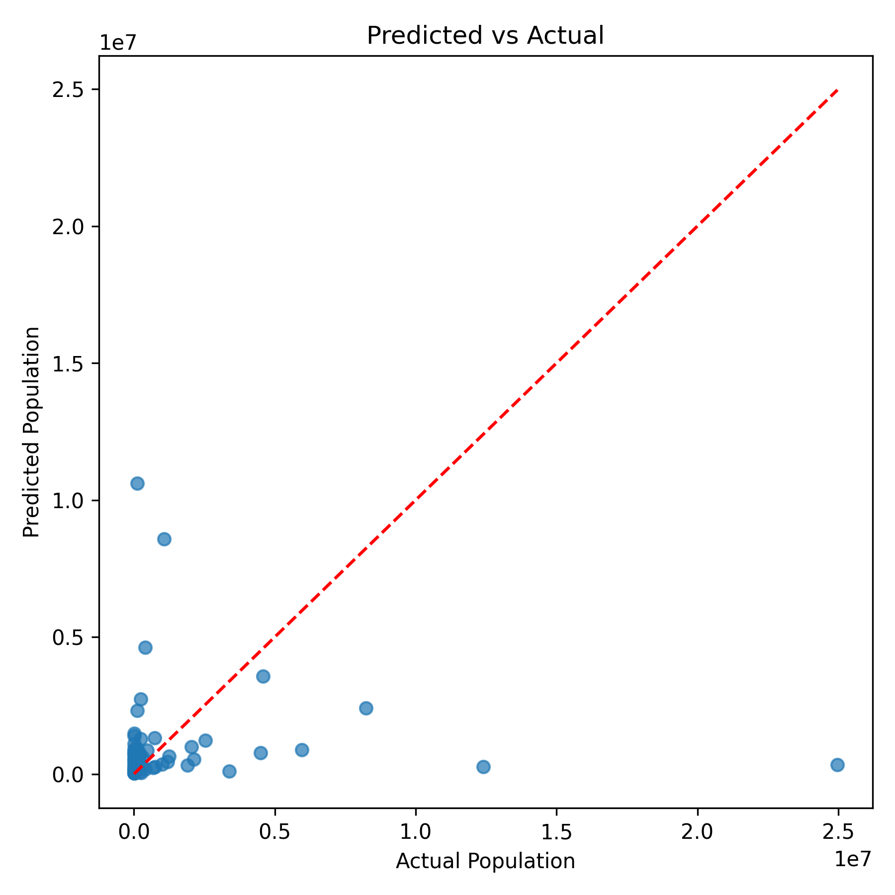

# 🌍 AI Population Estimator

An AI-powered application that estimates the population of Indian cities using **NASA VIIRS Night-Time Light satellite imagery**, **Google Earth Engine**, **Random Forest Regression**, and **Streamlit**.

---

## 🚀 Project Overview

Traditional population surveys and censuses are expensive, time-consuming, and conducted only once every few years. This project explores an alternative approach by using satellite-derived night-light intensity to estimate city populations through Machine Learning.

The model learns the relationship between **night-time light intensity** and **known population data**, enabling population prediction for cities where only satellite imagery is available.

---

## ✨ Features

- 🛰 Extracts Night-Time Light features using Google Earth Engine
- 🌍 Uses NASA VIIRS 2023 Annual Night Lights dataset
- 🤖 Population prediction using Random Forest Regression
- 📊 Feature Engineering for improved model performance
- 📈 Interactive Streamlit dashboard
- 📉 Displays model evaluation metrics
- 📍 Predicts population for Indian cities

---

## 🛠️ Tech Stack

| Category | Technology |
|----------|------------|
| Programming Language | Python |
| Machine Learning | Scikit-learn |
| Dashboard | Streamlit |
| Data Processing | Pandas, NumPy |
| Visualization | Matplotlib |
| Satellite Data | NASA VIIRS |
| Geospatial Platform | Google Earth Engine |
| Model Storage | Joblib |

---

## 📂 Project Structure

```text
AI-Population-Estimator
│
├── data
│   ├── city_population.csv
│   └── Indian_City_NightLights.csv
│
├── images
│   ├── feature_importance.png
│   └── prediction_plot.png
│
├── models
│   ├── population_model.pkl
│   └── model_metrics.json
│
├── src
│   ├── feature_extraction.py
│   ├── image_reader.py
│   └── train_model.py
│
├── app.py
├── requirements.txt
├── .gitignore
└── README.md
```

---

## 🛰 Dataset

### Satellite Dataset

- NASA VIIRS Annual Night-Time Lights (2023)
- Extracted using Google Earth Engine

### Population Dataset

- Indian city population dataset
- Used as the target variable during model training

---

## ⚙️ Feature Engineering

The following features are used:

- Average Brightness
- Maximum Brightness
- Minimum Brightness
- Standard Deviation
- Brightness Range
- Brightness Ratio
- Brightness Product

---

## 🤖 Machine Learning Model

Algorithm Used:

**Random Forest Regression**

Workflow:

1. Collect satellite imagery
2. Extract night-light statistics
3. Merge with population dataset
4. Perform feature engineering
5. Train Random Forest model
6. Evaluate performance
7. Save trained model
8. Deploy with Streamlit

---

## 📊 Model Evaluation

The model is evaluated using:

- Mean Absolute Error (MAE)
- Root Mean Squared Error (RMSE)
- R² Score

The evaluation metrics are automatically stored in:

```text
models/model_metrics.json
```

---

## 🖥️ Dashboard

The Streamlit dashboard allows users to:

- Select a city
- View satellite-derived features
- Predict city population
- Compare actual vs predicted population
- View model insights
- Explore the dataset

---


> *(Add dashboard screenshot here)*
## 📸 Screenshots

### Dashboard



### Dashboard - Prediction



### Dashboard - Dataset Preview



### Feature Importance



### Prediction Plot



## ▶️ Installation

Clone the repository

```bash
git clone https://github.com/himanshiagrawal22/AI-Population-Estimator.git
```

Go to project folder

```bash
cd AI-Population-Estimator
```

Install dependencies

```bash
pip install -r requirements.txt
```

Run the application

```bash
streamlit run app.py
```

---

## 🔮 Future Improvements

- 📅 Multi-year population estimation
- 🗺️ Interactive map integration
- 📍 Display city location
- 🌍 Automatic satellite data fetching
- ☁️ Cloud deployment
- 📈 Model explainability (SHAP)
- 🛰 Support for multiple countries

---

## 👩‍💻 Author

**Himanshi Agrawal**

B.Tech (Information Technology)

Machine Learning | Geospatial AI | Computer Vision | Data Science

GitHub:
https://github.com/himanshiagrawal22

---

## ⭐ If you found this project useful, consider giving it a star!